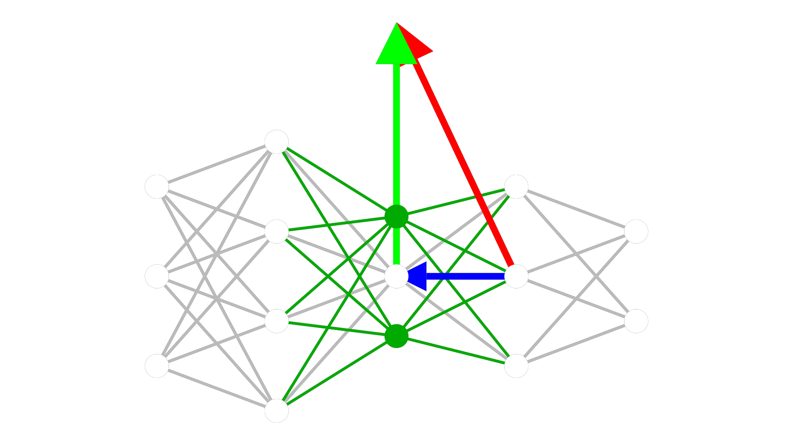

<p align=center>
  
</p>

[](https://codecov.io/github/growingnet/gromo)
[](https://github.com/growingnet/gromo/actions/workflows/tests.yml)
[](https://github.com/growingnet/gromo/actions/workflows/ruff-check.yml)

# GroMo

Gromo is a collaborative effort for designing efficient and growable networks
for machine learning. It is a Python package that provides a set of tools for
pytorch users to train neural networks, that grow in size and complexity as
they learn. The package is designed to be modular and flexible, allowing users
to easily design and train their own networks.

The package is built on top of `torch.nn.Module`,
examples shows how to use the package to train a simple neural network, and how
to grow the network as it learns. The theoretical and algorithmic details of
Gromo are described in the paper indicated below.

The package is still in development, if you would like to contribute, please
contact us!

```
Verbockhaven, M., Rudkiewicz, T., Chevallier, S., and Charpiat, G. (2024). Growing tiny networks: Spotting expressivity bottlenecks and fixing them optimally. Transactions on Machine Learning Research.
```

```
Douka, S., Verbockhaven, M., Rudkiewicz, T., Rivaud, S., Landes, F., Chevallier, S., Charpiat, G. (2025). Growth strategies for arbitrary DAG neural architectures. European Symposium on Artificial Neural Networks.
```

## Installation

### For users

Simply run the following commands to install the package:

```bash
pip install build
git clone https://github.com/growingnet/gromo.git
cd gromo
python -m build
pip install -e .
```

You may also clone with SSH if you have set up your SSH keys with GitHub: `git clone git@github.com:growingnet/gromo.git`.

### For developers

To set up a development environment, first ensure that you have an ssh key set up with GitHub. Then, you can use the following commands:

```bash
pip install build
git clone git@github.com:growingnet/gromo.git
cd gromo
python -m build
pip install -e .[dev,test]
pre-commit install
```

## Documentation

The documentation for Gromo can be found at: https://growingnet.github.io/gromo/
