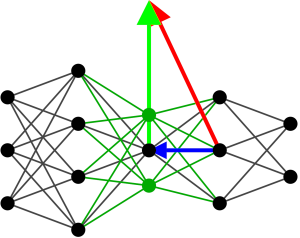

.. currentmodule:: gromo

-----
GroMo
-----

Gromo is a collaborative effort for designing efficient and growable networks
for machine learning. It is a Python package that provides a set of tools for
pytorch users to train neural networks, that grow in size and complexity as
they learn. The package is designed to be modular and flexible, allowing users
to easily design and train their own networks.

The package is built on top of `torch.nn.Module`, examples shows how to use
the package to train a simple neural network, and how to grow the network as
it learns. The theoretical and algorithmic details of Gromo are described in
the [TMLR24]_.

The package is still in development, if you would like to contribute, please
contact us!

.. [TMLR24] Verbockhaven, M., Rudkiewicz, T., Chevallier, S., and Charpiat, G.
        (2024). Growing tiny networks: Spotting expressivity bottlenecks and
        fixing them optimally. TMLR.

Installation
~~~~~~~~~~~~

Simply run the following commands to install the package:

.. code-block:: bash

    pip install build
    git clone https://github.com/growingnet/gromo.git
    cd gromo
    python -m build
    pip install -e .

You may also clone with SSH if you have set up your SSH keys with GitHub:

.. code-block:: bash

    git clone git@github.com:growingnet/gromo.git

Getting started
~~~~~~~~~~~~~~~

To learn how to use Gromo, we recommend starting with the following tutorials:

- `GrowingContainer Tutorial <auto_examples/plot_growing_container_tutorial.html>`_ that shows how to use a growing neural network and train it on a simple dataset.
- `GrowingModule Tutorial <auto_examples/plot_growing_module_tutorial.html>`_ that gets a little bit deeper into the details of growing modules.
